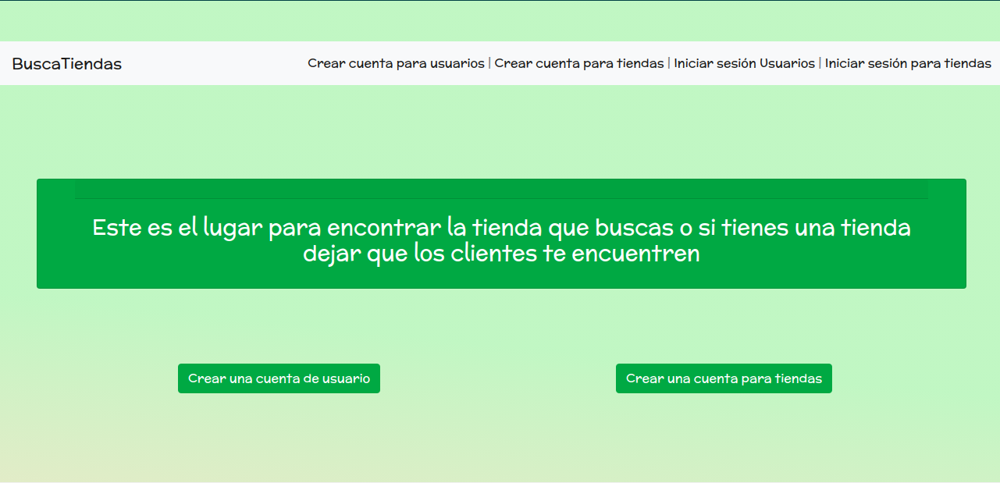

# Busca tu tienda (web app)

*  Link a tablero con historias de usuario en:
    * https://trello.com/b/RND3XJ86

* Link a Heroku : 
    * https://busca-tiendas.herokuapp.com/

* Link dominio:
    * http://www.buscatutienda2020.tk

* Modelo del proyecto :

* ActiveAdmin:
    * https://busca-tiendas.herokuapp.com/admin/dashboard 
        * Email: emailpararails2020@gmail.com
        * Password: p12345d 

* Tecnologías utilizadas:

    * Ruby '2.5.3'
    * Rails, '~> 5.2.4'

    * Gemas utilizadas:
        
        * gem 'active_storage_validations'
        * gem "devise", "~> 4.7"
        * gem 'activeadmin'
        * gem 'aws-sdk-s3'
        * gem 'omniauth-facebook'
        * gem "chartkick"
        * gem 'kaminari'
        * gem 'groupdate'
        * gem 'sendgrid-ruby'
        * gem 'ransack', github: 'activerecord-hackery/ransack'
        * gem 'paypal-sdk-rest'
        * gem 'rollbar'

*       
